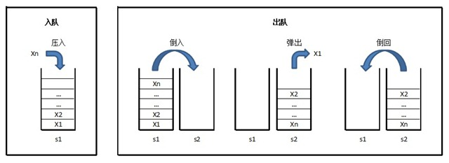

# 剑指Offer（五）：用两个栈实现队列

> 搜索微信公众号:'AI-ming3526'或者'计算机视觉这件小事' 获取更多算法、机器学习干货  
> csdn：https://blog.csdn.net/baidu_31657889/  
> github：https://github.com/aimi-cn/AILearners

## 一、引子

这个系列是我在牛客网上刷《剑指Offer》的刷题笔记，旨在提升下自己的算法能力。  
查看完整的剑指Offer算法题解析请点击：[剑指Offer完整习题解析](https://blog.csdn.net/baidu_31657889/article/category/9059648)

## 二、题目

用两个栈来实现一个队列，完成队列的Push和Pop操作。 队列中的元素为int类型。

### 1、思路

队列是先进先出，栈是先进后出，如何用两个栈来实现这种先进先出呢？

其实很简单，我们假设用stack1专门来装元素，那么直接stack1.pop肯定是不行的，这个时候stack2就要发挥作用了。

我们的规则是：当stack2中不为空时，在stack2中的栈顶元素是最先进入队列的元素，可以弹出。如果stack2为空时，我们把stack1中的元素逐个弹出并压入stack2。由于先进入队列的元素被压倒stack1的栈底，经过弹出和压入之后就处于stack2的栈顶，有可以直接弹出。如果有新元素d插入，我们直接把它压入stack1即可。

这样就能保证每次stack2中pop出来的元素是最老的元素了

示意图：



### 2、编程实现

**python2.7**

代码实现：

```python
# -*- coding:utf-8 -*-
class Solution:
    def __init__(self):
        self.stack1 = []
        self.stack2 = []
    def push(self, node):
        self.stack1.append(node)
    def pop(self):
        if len(self.stack2) == 0:
            while self.stack1:
                self.stack2.append(self.stack1.pop())
        return self.stack2.pop()
```


