# 【2017cs231n】课程笔记-第2讲：图像分类

> 搜索微信公众号:'AI-ming3526'或者'计算机视觉这件小事' 获取更多算法、机器学习干货  
> csdn：https://blog.csdn.net/baidu_31657889/  
> github：https://github.com/aimi-cn/AILearners

## 课程简介

斯坦福CS231n(面向视觉识别的卷积神经网络)课程大家都很熟悉了，深度学习入门必备课程。  
这是一门每学期的视频更新都会引起一波尖叫的明星课。我参照的是2017版。

## 课程资源

课程地址：http://cs231n.stanford.edu/

[课程地址中文版-网易云课程](https://study.163.com/note/noteIndex.htm?id=1004697005&type=0)  

[课程地址中文版-b站](https://space.bilibili.com/216720985/channel/detail?cid=32406)  

[课程笔记github地址](https://github.com/aimi-cn/AILearners/tree/master/blog/dl/cs231n)

课程ppt地址：关注公众号“计算机视觉这件小事”或者“AI-ming3526” 回复关键字“cs231n”免费获取

## 课程作业

官方笔记作业地址：http://cs231n.github.io/

在写笔记的过程中 我会寻找一下19年或者18年的课程作业来做一下 可能会有用到pytorch和tensorflow可以顺便锻炼一下代码能力 

# section2.1 数据驱动方法

在上一讲，提到了关于图像分类的任务，这是一个计算机视觉中真正核心的任务，同时也是本课程中关注的重点。

当做图像分类时，分类系统接收一些输入图像，并且系统已经清楚了一些已经确定了分类或者标签的集合，标签可能是猫、狗、汽车以及一些固定的类别标签集合等等；计算机的工作就是观察图片并且给它分配其中一些固定的分类标签。对于人来说这是非常简单的事情，但对计算机来说，却是非常困难的事情。

当一个计算机看这些图片的时候，他看到的是什么那，他肯定没有一直猫咪的整个概念，而不像我们看到的一样，计算机图片的方式其实就是一大堆数字。所以图像大小(如上图)可能是宽600像素，高800像素，有3个颜色通道，分别是红、绿和蓝（简称RGB）。如此，该图像就包含了600X800X3=1440000个数字，每个数字都是在范围0-255之间的整型，其中0表示全黑，255表示全白。我们的任务就是把这些上百万的数字变成一个简单的标签，比如“猫”。

所以，对计算机来说，这就是一个巨大的数字阵列，很难从中提取出猫咪的特征，我们把这个问题称为“语义鸿沟”。对于猫咪的概念或者它的标签，是我们赋予图像的一个语义标签，而猫咪的语义标签和计算机实际看到的像素值之间有很大的差距。

困难和挑战：对于人来说，识别出一个像“猫”一样视觉概念是简单至极的，然而从计算机视觉算法的角度来看就值得深思了。我们在下面列举了计算机视觉算法在图像识别方面遇到的一些困难，要记住图像是以3维数组来表示的，数组中的元素是亮度值。

- 视角变化：同一个物体，摄像机可以从多个角度来展现。
- 大小变化：物体可视的大小通常是会变化的（不仅是在图片中，在真实世界中大小也是变化的）。
- 形变：很多东西的形状并非一成不变，会有很大变化。
- 遮挡：目标物体可能被挡住。有时候只有物体的一小部分（可以小到几个像素）是可见的。
- 光照条件：在像素层面上，光照的影响非常大。
- 背景干扰：物体可能混入背景之中，使之难以被辨认。
- 类内差异：一类物体的个体之间的外形差异很大，比如椅子。这一类物体有许多不同的对象，每个都有自己的外形。

面对以上所有变化及其组合，好的图像分类模型能够在维持分类结论稳定的同时，保持对类间差异足够敏感。

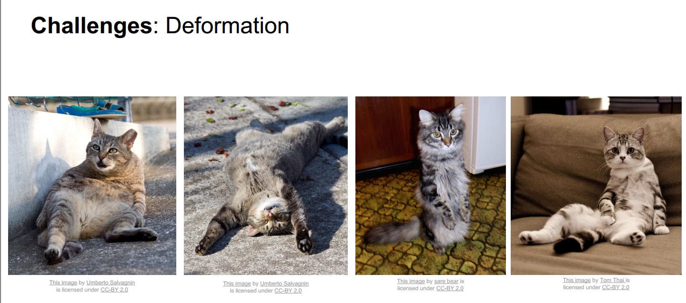
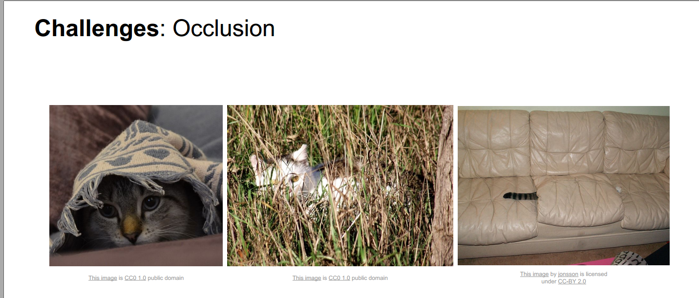

如果使用python写一个图像分类器，定义一个方法，接受图片作为输入参数，来一波神操作，最终返回到图片上进行标记是猫还是狗等等。但是并什么简单明了的算法可以直接完成这些识别，所以图像识别算法很难。

对于猫来说，它有耳朵、眼睛、鼻子、嘴巴，而通过上一章中Hubel和Wiesel的研究，我们了解到边缘对于视觉识别是十分重要的，所以尝试计算出图像的边缘，然后把边、角各种形状分类好，可以写一些规则来识别这些猫。

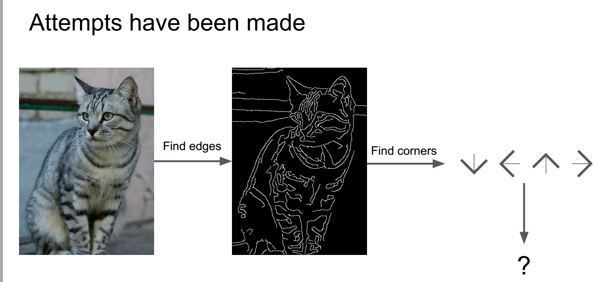

但是如果想识别比如卡车、其他动物等，又需要重新从头再来一遍，所以这不是一种可推演的方法，我们需要的是一种识别算法可以拓展到识别世界上各种对象，由此我们想到了一种数据驱动的方法。

 我们并不需要具体的分类规则来识别一只猫或鱼等其他的对象，取而代之的方法是：

    （1）首先收集不同类别图片的示例图，制作成带有标签的图像数据集；

    （2）然后用机器学习的方法来训练一个分类器；

    （3）最后用这个分类器来识别新的图片，看是否能够识别。

所以，如果写一个方法，可以定义两个函数，一个是训练函数，用来接收图片和标签，然后输出模型；另一个数预测函数，接收一个模型，对图片种类进行预测。

这种数据驱动类的算法是比深度学习更广义的一种理念，通过这种过程，最简单的分类器（最近邻分类器），在训练过程中，我们只是单纯的记录所有的训练数据；在预测过程中，拿新的图像与已训练好的训练对比，进行预测。

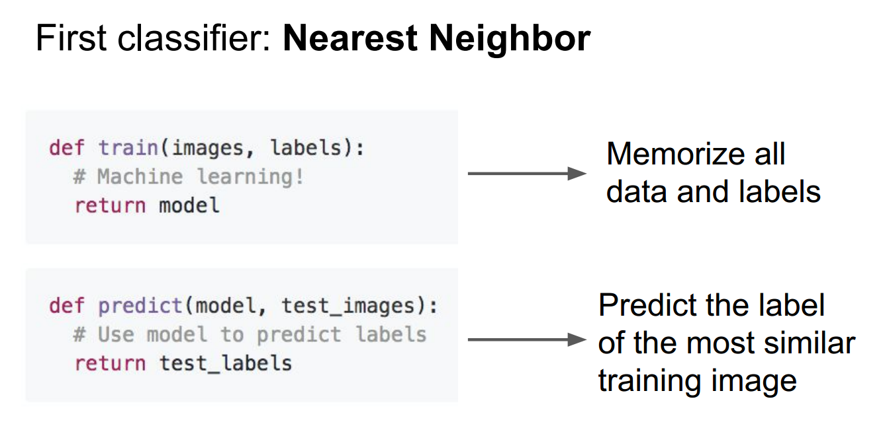

图像分类数据集：[CIFAR-10](http://www.cs.toronto.edu/~kriz/cifar.html)。一个非常流行的图像分类数据集是CIFAR-10。这个数据集包含了60000张32X32的小图像。每张图像都有10种分类标签中的一种。这60000张图像被分为包含50000张图像的训练集和包含10000张图像的测试集。在下图左侧中你可以看见10个类的10张随机图片。

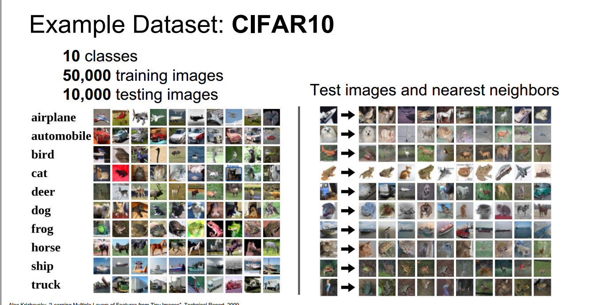

左边：从CIFAR-10数据库来的样本图像。右边：第一列是测试图像，然后第一列的每个测试图像右边是使用Nearest Neighbor算法，根据像素差异，从训练集中选出的10张最类似的图片。

我们需要知道一个细节问题：给定两幅图片，该怎么对它们进行比较？

如果将测试图片和所有训练图片进行比较，将有很多不同的选择来确定需要什么样的比较函数。我们可以使用L1距离（有时称为曼哈顿距离），这是一个简单的比较图片的方法，只是对这些图片中的单个像素进行比较：

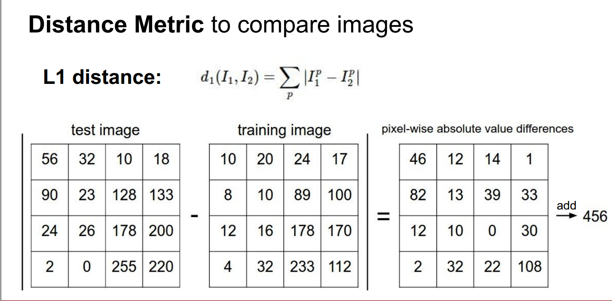

测试和训练两张图片使用L1距离来进行比较。图像逐个像素求差值，然后将所有差值加起来得到一个数值。如果两张图片一模一样，那么L1距离为0，但是如果两张图片很是不同，那L1值将会非常大。

虽然这个方法有些笨，但是有些时候却有它的合理性，它给出了比较两幅图片的具体方法。

下面是最近邻分类器的python代码

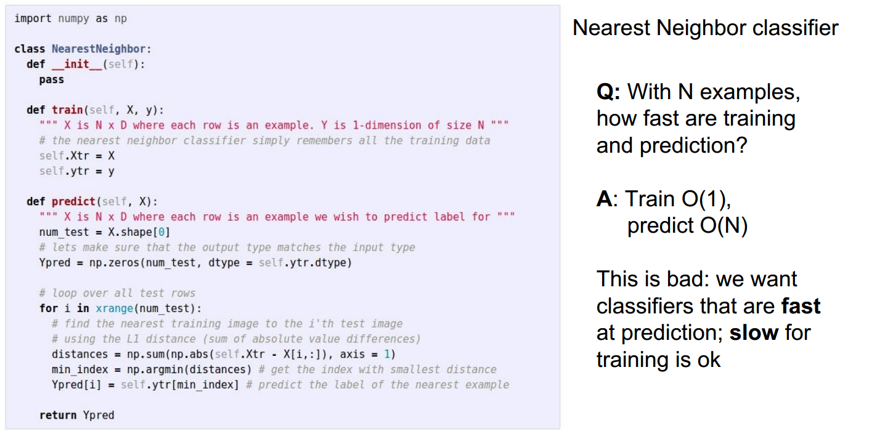

但是最近邻算法会出现下面的问题，如果我们在训练集中有N个实例，训练和测试的过程时间复杂度的情况那，答案是训练：O(1)  测试：O(N)，由此看来最近邻算法有点落后了，它在训练中花的时间很少，而在测试中花了大量时间；而看卷积神经网络和其他参数模型，则正好相反，它们会花很多时间在训练上，而在测试过程中则非常快。我们希望的是测试能够更快一点，而训练慢一点没有关系，它是在数据中心完成的。

那么在实际应用中，最近邻算法到底表现如何?可以看到下面的图像：

它是最近邻分类器的决策区域，训练集包含二维平面中的这些点，点的颜色代表不同的类别或不同的标签，这里有五种类型的点。对于这些点来说，将计算这些训练数据中最近的实例，然后在这些点的背景上着色，标示出它的类标签，可以发现最近邻分类器是根据相邻的点来切割空间并进行着色。

但是通过上述图片中，可以看到绿色区域中间的黄色区域（事实上该点应该是绿色的），蓝色区域中有绿色区域的一部分，这些都说明了最近邻分类器的处理是有问题的。

那么，基于以上问题，产生了K-近邻算法，它不仅是寻找最近的点，还会做一些特殊的操作，根据距离度量，找到最近的K个点，然后在这些相邻点中进行投票，票数多的近邻点预测出结果。

下面用同样的数据集分别使用K=1、K=3、K=5的最近邻分类器：

在K=3时，可以看到绿色区域中的黄色点不再会导致周围的区域被划分成黄色，因为使用了多数投票，中间的这个绿色区域都会被划分成绿色；在K=5时，可以看到蓝色和红色区域间的决策边界变得更加平滑好看。

所以使用最近邻分类器时，总会给K赋一个比较大的值，这会是决策边界变得更加平滑，从而得到更好的结果。当然这个值也不能太大，要在你测试或者训练样本的大小上调整。

之前写过的一个机器学习实战的k-近邻算法例子-识别手写数字：https://blog.csdn.net/baidu_31657889/article/details/89095213

学生提问：上图中白色区域代表什么？

答：白色区域表示这个区域没有获得K-最近邻的投票，可以做大胆的假设，把它划分为一个不同的类别。

# section2.2 K-近邻算法

继续讨论KNN（K-最近邻算法），回到图片中来，它实际表现的并不好，用红色和绿色分别标注了图像分类的正确与否：

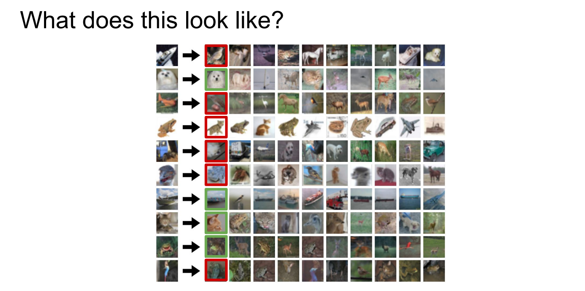

取决于它的近邻值，可以看到KNN的表现效果不是很好，但如果可以使用一个更大的K值，那么投票操作的结果就可能会达到很好的分类效果。

当我们使用K-最近邻算法时，确定应该如何比较相对近邻数据距离值。比如，已经讨论过的L1距离，它是像素之间绝对值的总和；另一种常见的选择是L2距离，也就是欧式距离（平方和的平方根）。

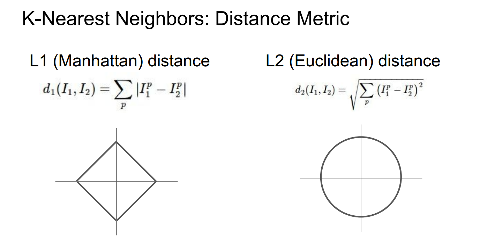

这两种方式，L1取决于你选择的坐标系统，所以如果转动坐标轴，将会改变点之间的L1距离；而改变坐标轴对L2距离无影响。

下面不同距离的决策边界的形状变化很大，L1中这些决策边界趋于跟随坐标轴，又是因为L1取决于我们选择的坐标系，L2对距离的排序不会受到坐标轴的影响，只是吧边界放置在最自然的地方。(好吧，我竟然看不出来太大区别==) 但是 http://vision.stanford.edu/teaching/cs231n-demos/knn/ 这个网站上的效果真的很明显，大家去看看，显然使用L2欧氏距离对拟合效果更好，边缘更加自然，这个KNN，实际上是非常有趣的，可以很好地培养决策边界的直觉。

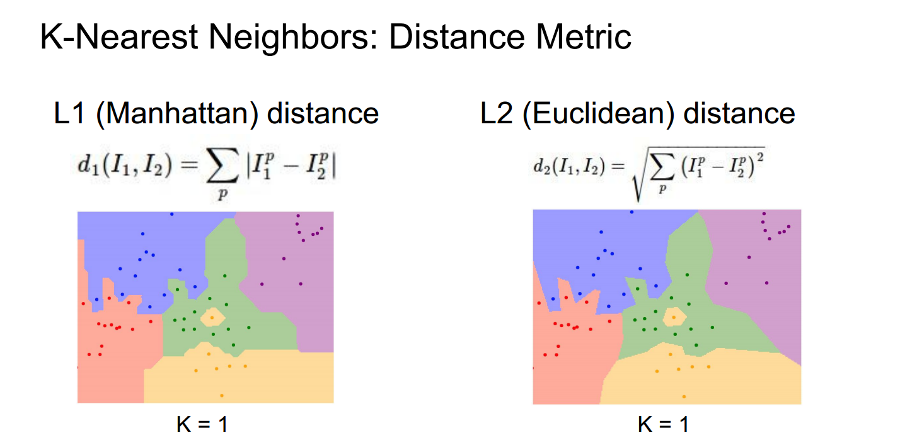

所以，一旦真的尝试在实践中使用这个算法，有几个选择是需要做的。比如，讨论过的选择K的不同值，选择不同的距离度量，该如何根据问题和数据来选择这些超参数，K值和距离度量称之为超参数，它们不一定能从训练数据中学到。

在实际中，大多使用k-NN分类器。但是k值或者说这些超参数如何确定呢？

### 错误的两种想法 Idea1 and Idea2

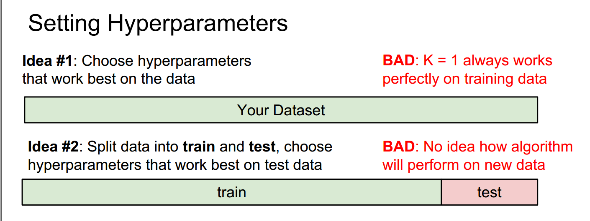

（1）选择能对训练集给出最高的准确率、表现最佳的超参数；

不要这么做，在机器学习中，不是要尽可能拟合训练集，而是要让分类器在训练集以外的未知数据上表现更好。如在k最近邻算法中，假设k=1，我们总能完美的分类训练集数据，在实践中，让k取更大的值，尽管会在训练集中分错个别数据，但对于训练集中未出现过的数据分类性能更佳。

（2）所有的数据分成两部分：一部分是训练集，另一部分是测试集，然后在训练集上使用不同的超参数来训练算法，将训练好的分类器用在测试集上，再选择一组在测试集上表现最好的超参数；

同样不要这么做，机器学习系统的目的是让我们了解算法表现究竟如何，所以测试集的目的是给我们一种预估方法，如果采用这种方法，只能让我们算法在这组测试集上表现良好，但它无法代表在未见过的数据上的表现。

###　正确的两种想法 Idea3 Idea4

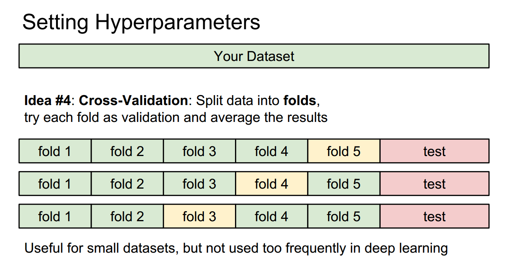

（3）所有数据分成三部分：训练集、验证集和测试集，大部分数据作为训练集，通常所做的是在训练集上用不同的超参数来训练算法，在验证集上进行评估，然后用一组超参选择在验证集上表现最好的，再把这组验证集上表现最好的分类器拿出来在测试集上运行，这才是正确的方法。

（4）交叉验证：在深度学习中不太常见。有时候，训练集数量较小（因此验证集的数量更小），这种方法更加复杂些。还是用刚才的例子，如果是交叉验证集，我们就不是取1000个图像，而是将训练集平均分成5份，其中4份用来训练，1份用来验证。然后我们循环着取其中4份来训练，其中1份来验证，最后取所有5次验证结果的平均值作为算法验证结果。

那么经过交叉验证可能会得到这样的一张图：

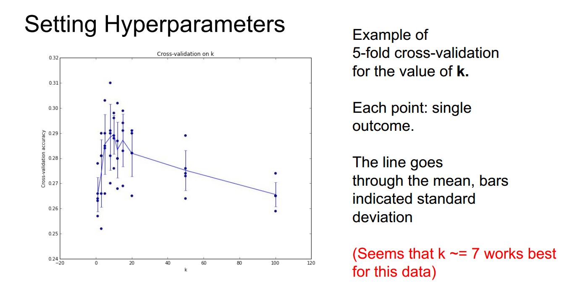

横轴表示K-近邻分类器中的参数K值，纵轴表示分类器对不同K值在数据上的准确率。这里用了5折交叉验证，对每个K值，都对算法进行了5次不同的测试来了解这个算法表现如何；所以当训练一个机器学习的模型时，最后要画这样一张图，从中可以看出算法的表现以及各个超参数之间的关系，最终可以选出在验证集上最好的模型以及相应的超参数。

其实，KNN在图像分类中很少用到。

（1）它的测试时间非常长

（2）像欧式距离或者L1距离这样的衡量标准用在比较图像上不太合适，这种向量化的距离函数不太适合表示图像之间视觉的相似度

究竟我们是如何区分图像不同呢？

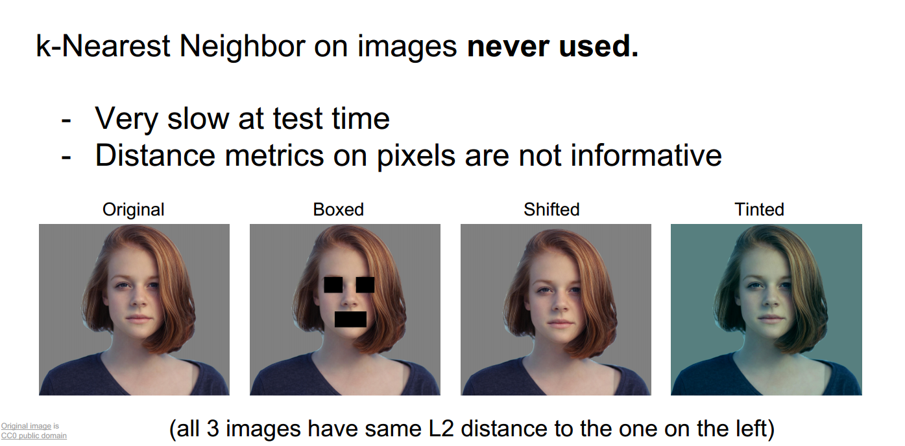

最左边是最原始的图片，右边是经过处理的图片，如遮住嘴，向下平移几个像素的距离，或者把整幅图染的偏蓝，如果计算原图和遮挡的图、平移、染色的图之间的欧几里得距离，结果是一样的，L2确实不适合表示图像之间视觉感知的差异。

为什么L2的距离是一样的，原因是我们在处理的时候故意这样做成原图和这些图计算L2距离相同，这样就可以显示L2距离甚至KNN都不适合图像之间的计算。

（3）维度灾难：KNN有点像把样本空间分成几块，意味着如果希望分类器有好的效果，需要训练数据密集的分布在空间中；而问题在于，想要密集的分布在样本空间中，需要指数倍的训练数据，然而不可能拿到这样高维空间中的像素。

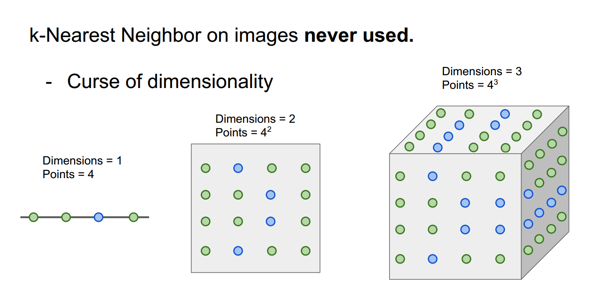

注意：这里的点是表示训练数据，点的颜色代表他们的类别。在一维空间，两个类别只需要4个点就可以把空间覆盖，二维空间的话就需要16个点，三维需要64个点，训练样本的个数是指数增长的，很恐怖。

### KNN：总结

在 **图像分类** 中，我们从一组 **训练数据集** 的图像和标签开始，并且必须预测 **测试集** 上的标签

**k近邻分类器** 基于最近的训练实例预测标签

距离度量（L1 L2）和K是 **超参数**

使用 **验证集** 选择超参数;我们的测试集要放到最后运行，而且只运行一次。

# section2.3 线性分类

线性分类非常重要，同时它也是一个相对简单的学习算法，这有助于我们建立起来整个神经网络和卷积网络。

线性分类就例如，你在玩乐高玩具的时候，搭出来的整个大的城堡或者什么东西相当于整个神经网络，而线性分类器就相当于整个乐高城堡的基础模块。

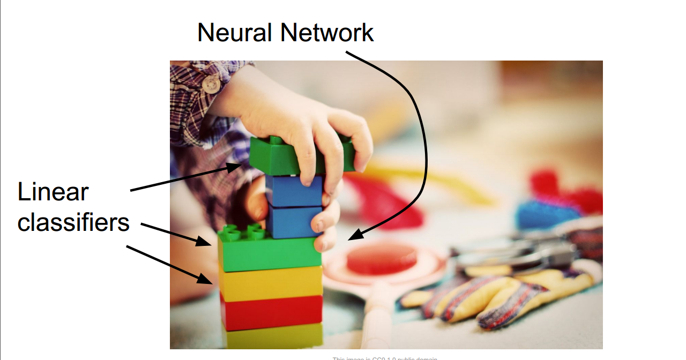

在线性分类中，将采用与K-最近邻稍有不同的方法，线性分类是参数模型中最简单的例子，以下图为例，我们使用的还是CIFAR10数据集，里面10个类别，每个图像大小为32 * 32 * 3。

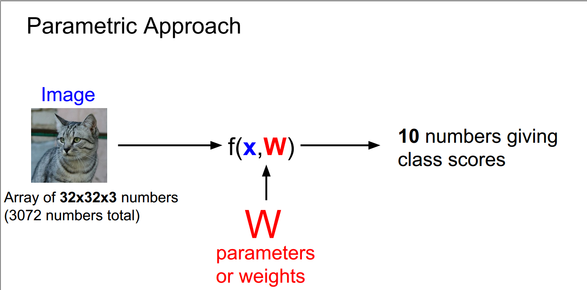

上图中32 * 32 * 3中3指的是RGB三通道，因为是彩色图像所以有三个通道，而灰色图像是二维的。

通常把输入数据设为x，权重设为w，现在写一些函数包含了输入参数x和参数w，然后就会有10个数字描述的输出，即在CIFAR-10中对应的10个类别所对应的分数。    现在，在这个参数化的方法中，我们总结对训练数据的认知并把它都用到这些参数w中，在测试的时候，不再需要实际的训练数据，只需要这些参数来预测结果，这使得模型更有效率。

在深度学习中，整个描述都是关于函数F正确的结构，可以来编写不同的函数形式用不同的、复杂的方式组合权重和数据，这些对应于不同的神经网络体系结构，将他们相乘是最简单的组合方式，这就是一个线性分类器。

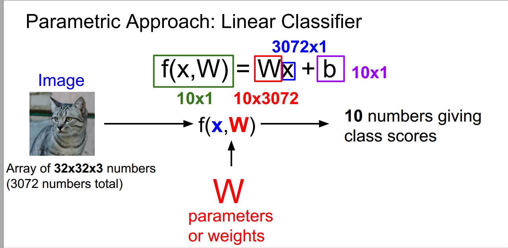

用自己的语言解释一下上图：最左边的猫是输入的图像，就相当于中间公式的X，输入图像大小是32 * 32 * 3一共是展开是3072 * 1的列向量，W我们可以把他相当于一个权重矩阵，他的作用就是记录我们在深度学习学习到的东西，在测试的时候只需要W矩阵就可以预测结果，W的大小是10 * 3072，W和X相乘之后，就会得到一个列向量，刚好是10 * 1，就对应最后十个分类的值，哪个分类的值最大，我们就认定这个图像的分类是那一类。有时候也会加上b，这是一个偏置项，他是给我们一些数据独立的偏好值，针对仅仅一类的偏好值。

线性分类器工作的例子如下：

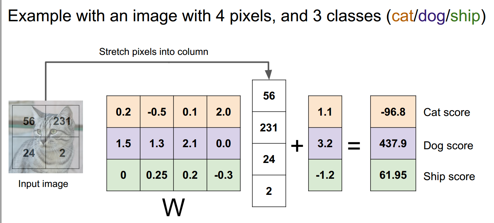

我们把2*2的图像拉伸成一个有4个元素的列向量，在这个例子中，只限制了3类：猫，狗，船；权重矩阵w是3行4列（4个像素3个类）；加上一个3元偏差向量，它提供了每个类别的数据独立偏差项；现在可以看到猫的分数是图像像素和权重矩阵之间的输入乘积加上偏置项。

下图是我们已经训练好的一个线性分类器，最下方是我们数据集中训练得到的权重矩阵中的行向量对应于10个类别相关的可视化结果。

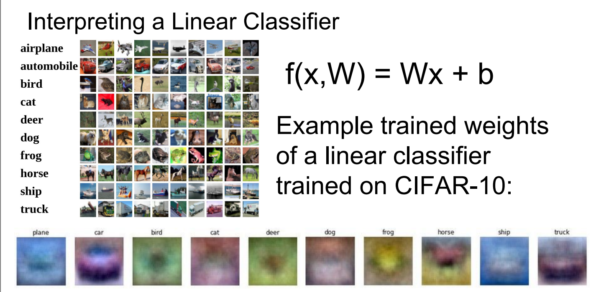

线性分类器的另一个观点是回归到图像，作为点和高维空间的概念，可以想像每一张图像都是类似高维空间中的一个点，现在线性分类器尝试在线性决策边界上画一个线性分类面来划分一个类别和剩余其他类别，如下图所示：

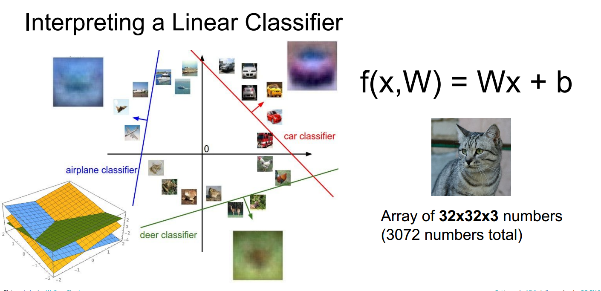

在训练过程中，这些线条会随机地开始，然后快速变化，试图将数据正确区分开，但是从这个高维的角度考虑线性分类器，就能再次看到线性分类器中出现的问题。

假设有一个两类别的数据集，蓝色和红色，蓝色类别是图像中像素数量大于0且都是奇数；红色类别是图像中像素数量大于0且都是偶数，如果去画这些不同的决策，能看到奇数像素点的蓝色类别在平面上有两个象限，所以没有办法能够绘制一条单独的直线来划分蓝色和红色，这就是线性分类器的问题所在。如下图最左边。

当然线性分类器还有其他难以解决的情况，比如多分类问题，如下图所示中间和最右边。 

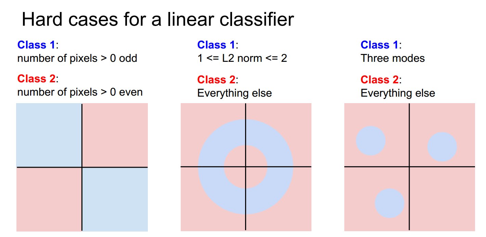

因此，线性分类器的确存在很多问题，但它是一个非常简单的算法，易于使用和理解。

### 总结：

本节中讨论了线性分类器对应的函数形式（矩阵向量相乘），对应于模版匹配和为每一类别学习一个单独的模板，一旦有了这个训练矩阵，可以用他得到任何新的训练样本的得分。

思考问题：如何给数据集选择一个正确的权重？这里包括损失函数和一些其他的优化方法，将在下一章中继续讨论。
