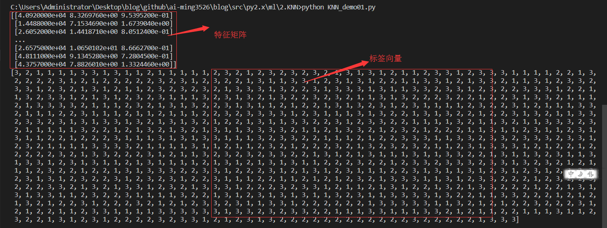
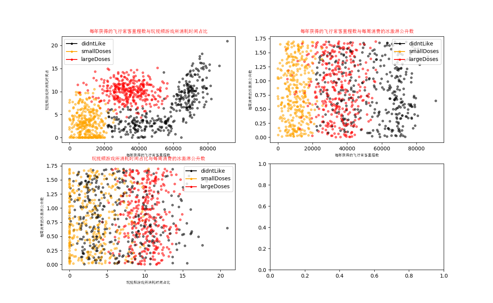
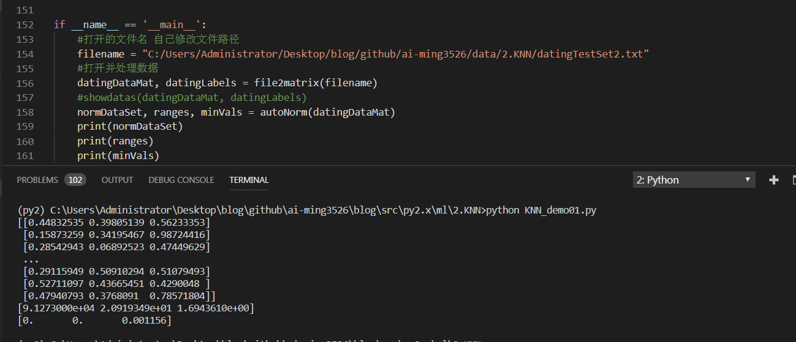
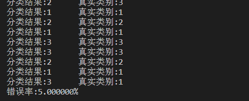

# k-近邻算法例子-优化约会网站的配对效果

> 搜索微信公众号:'AI-ming3526'或者'计算机视觉这件小事' 获取更多机器学习干货
> csdn：https://blog.csdn.net/baidu_31657889/
> github：https://github.com/aimi-cn/AILearners

本文参考地址：[[apachecn/AiLearning](https://github.com/apachecn/AiLearning)]；
<https://blog.csdn.net/c406495762/article/details/75172850>

本文出现的所有代码，均可在github上下载，不妨来个Star把谢谢~：[Github代码地址](https://github.com/aimi-cn/AILearners/tree/master/src/py2.x/ml/jqxxsz/2.KNN/)

## 项目案例1: 优化约会网站的配对效果

[完整代码地址](https://github.com/aimi-cn/AILearners/tree/master/src/py2.x/ml/jqxxsz/2.KNN/KNN_demo01.py)

**上一小结学习了简单的k-近邻算法的实现方法，但是这并不是完整的k-近邻算法流程，k-近邻算法的一般流程：**

1. 收集数据：可以使用爬虫进行数据的收集，也可以使用第三方提供的免费或收费的数据。一般来讲，数据放在txt文本文件中，按照一定的格式进行存储，便于解析及处理。
2. 准备数据：使用Python解析、预处理数据。
3. 分析数据：可以使用很多方法对数据进行分析，例如使用Matplotlib将数据可视化。
4. 测试算法：计算错误率。
5. 使用算法：错误率在可接受范围内，就可以运行k-近邻算法进行分类。

已经了解了k-近邻算法的一般流程，下面开始进入实战内容。

### 1.1 项目概述

海伦女士一直使用在线约会网站寻找适合自己的约会对象。尽管约会网站会推荐不同的任选，但她并不是喜欢每一个人。经过一番总结，她发现自己交往过的人可以进行如下分类：

- 不喜欢的人
- 魅力一般的人
- 极具魅力的人

海伦收集约会数据已经有了一段时间，她把这些数据存放在文本文件[datingTestSet2.txt](https://github.com/aimi-cn/AILearners/tree/master/data/ml/jqxxsz/2.KNN/datingTestSet2.txt) 中，每个样本数据占据一行，总共有1000行。

海伦约会的对象主要包含以下 3 种特征：

- 每年获得的飞行常客里程数
- 玩视频游戏所耗时间百分比
- 每周消费的冰淇淋公升数

文本文件数据格式如下：

```
飞行里程数    玩视频游戏百分比 每周消费的冰淇淋公升数 		特征
40920		8.326976	   0.953952					3 极具魅力的人(in large doses)
14488		7.153469	   1.673904					2 魅力一般的人(in small doses)
26052	    1.441871	   0.805124	  				1 不喜欢的人(not at all)
75136	    13.147394	   0.428964					1 不喜欢的人(not at all)
38344	    1.669788	   0.134296					1 不喜欢的人(not at all)
```

ps：拿每周吃冰激凌的多少来择偶 哈哈

### 2.2 准备数据：数据解析

在将上述特征数据输入到分类器前，必须将待处理的数据的格式改变为分类器可以接收的格式。分类器接收的数据是什么格式的？从上小结已经知道，要将数据分类两部分，即特征矩阵和对应的分类标签向量。在KNN_demo01.py文件中创建名为file2matrix的函数，以此来处理输入格式问题。 将datingTestSet.txt放到与KNN_demo01.py相同目录下，编写代码如下：

```python
#!/usr/bin/env python
# -*- encoding: utf-8 -*-
'''
@File    :   KNN_demo01.py
@Time    :   2019/03/30 14:39:07
@Author  :   xiao ming 
@Version :   1.0
@Contact :   xiaoming3526@gmail.com
@Desc    :   2.2.k-近邻算法例子-优化约会网站的配对效果
@github  :   https://github.com/aimi-cn/AILearners

'''

# here put the import lib
import numpy as np
from matplotlib.font_manager import FontProperties
import matplotlib.lines as mlines
import matplotlib.pyplot as plt
"""
函数说明:打开并解析文件，对数据进行分类：1代表不喜欢,2代表魅力一般,3代表极具魅力

Parameters:
    filename - 文件名
Returns:
    returnMat - 特征矩阵
    classLabelVector - 分类Label向量

Modify:
    2017-03-24
"""
def file2matrix(filename):
    #打开文件
    fr = open(filename)
    #读取文件所有内容
    arrayLines = fr.readlines()
    #得到文件行数
    numberOfLines = len(arrayLines)
    #返回的NumPy矩阵,解析完成的数据:numberOfLines行,3列
    # 生成对应的空矩阵
    # 例如：zeros(2，3)就是生成一个 2*3(2行三列的)的矩阵，各个位置上全是 0 
    returnMat = np.zeros((numberOfLines,3))
    #返回的分类标签向量
    classLabelVector = []
    #行的索引值
    index = 0
    for line in arrayLines:
        #s.strip(rm)，当rm空时,默认删除空白符(包括'\n','\r','\t',' ')
        line = line.strip()
        #使用s.split(str="",num=string,cout(str))将字符串根据'\t'分隔符进行切片。
        listFormLine = line.split('\t')
        #将数据前三列提取出来,存放到returnMat的NumPy矩阵中,也就是特征矩阵
        returnMat[index,:] = listFormLine[0:3]
        # 每列的类别数据，就是 label 标签数据
        classLabelVector.append(int(listFormLine[-1]))
        index += 1
    return returnMat, classLabelVector

if __name__ == '__main__':
    #打开的文件名  修改自己的路径
    filename = "C:/Users/Administrator/Desktop/blog/github/AILearners/data/2.KNN/datingTestSet2.txt"
    #打开并处理数据
    datingDataMat, datingLabels = file2matrix(filename)
    print(datingDataMat)
    print(datingLabels)
```

结果如下图所示：



### 2.3 分析数据：数据可视化

在KNN_demo01.py文件中编写名为showdatas的函数，用来将数据可视化。编写代码如下：

```python
"""
函数说明:可视化数据

Parameters:
    datingDataMat - 特征矩阵
    datingLabels - 分类Label
Returns:
    无
Modify:
    2017-03-24
"""
def showdatas(datingDataMat, datingLabels):
    #设置汉字格式
    font = FontProperties(fname=r"c:\windows\fonts\simsun.ttc", size=14)
    #将fig画布分隔成1行1列,不共享x轴和y轴,fig画布的大小为(13,8)
    #当nrow=2,nclos=2时,代表fig画布被分为四个区域,axs[0][0]表示第一行第一个区域
    fig, axs = plt.subplots(nrows=2, ncols=2,sharex=False, sharey=False, figsize=(13,8))

    numberOfLabels = len(datingLabels)
    LabelsColors = []
    for i in datingLabels:
        if i == 1:
            LabelsColors.append('black')
        if i == 2:
            LabelsColors.append('orange')
        if i == 3:
            LabelsColors.append('red')
    #画出散点图,以datingDataMat矩阵的第一(飞行常客例程)、第二列(玩游戏)数据画散点数据,散点大小为15,透明度为0.5
    axs[0][0].scatter(x=datingDataMat[:,0], y=datingDataMat[:,1], color=LabelsColors,s=15, alpha=.5)
    #设置标题,x轴label,y轴label
    axs0_title_text = axs[0][0].set_title(u'每年获得的飞行常客里程数与玩视频游戏所消耗时间占比',FontProperties=font)
    axs0_xlabel_text = axs[0][0].set_xlabel(u'每年获得的飞行常客里程数',FontProperties=font)
    axs0_ylabel_text = axs[0][0].set_ylabel(u'玩视频游戏所消耗时间占',FontProperties=font)
    plt.setp(axs0_title_text, size=9, weight='bold', color='red') 
    plt.setp(axs0_xlabel_text, size=7, weight='bold', color='black') 
    plt.setp(axs0_ylabel_text, size=7, weight='bold', color='black')

    #画出散点图,以datingDataMat矩阵的第一(飞行常客例程)、第三列(冰激凌)数据画散点数据,散点大小为15,透明度为0.5
    axs[0][1].scatter(x=datingDataMat[:,0], y=datingDataMat[:,2], color=LabelsColors,s=15, alpha=.5)
    #设置标题,x轴label,y轴label
    axs1_title_text = axs[0][1].set_title(u'每年获得的飞行常客里程数与每周消费的冰激淋公升数',FontProperties=font)
    axs1_xlabel_text = axs[0][1].set_xlabel(u'每年获得的飞行常客里程数',FontProperties=font)
    axs1_ylabel_text = axs[0][1].set_ylabel(u'每周消费的冰激淋公升数',FontProperties=font)
    plt.setp(axs1_title_text, size=9, weight='bold', color='red') 
    plt.setp(axs1_xlabel_text, size=7, weight='bold', color='black') 
    plt.setp(axs1_ylabel_text, size=7, weight='bold', color='black')

    #画出散点图,以datingDataMat矩阵的第二(玩游戏)、第三列(冰激凌)数据画散点数据,散点大小为15,透明度为0.5
    axs[1][0].scatter(x=datingDataMat[:,1], y=datingDataMat[:,2], color=LabelsColors,s=15, alpha=.5)
    #设置标题,x轴label,y轴label
    axs2_title_text = axs[1][0].set_title(u'玩视频游戏所消耗时间占比与每周消费的冰激淋公升数',FontProperties=font)
    axs2_xlabel_text = axs[1][0].set_xlabel(u'玩视频游戏所消耗时间占比',FontProperties=font)
    axs2_ylabel_text = axs[1][0].set_ylabel(u'每周消费的冰激淋公升数',FontProperties=font)
    plt.setp(axs2_title_text, size=9, weight='bold', color='red') 
    plt.setp(axs2_xlabel_text, size=7, weight='bold', color='black') 
    plt.setp(axs2_ylabel_text, size=7, weight='bold', color='black')
    #设置图例
    didntLike = mlines.Line2D([], [], color='black', marker='.',
                      markersize=6, label='didntLike')
    smallDoses = mlines.Line2D([], [], color='orange', marker='.',
                      markersize=6, label='smallDoses')
    largeDoses = mlines.Line2D([], [], color='red', marker='.',
                      markersize=6, label='largeDoses')
    #添加图例
    axs[0][0].legend(handles=[didntLike,smallDoses,largeDoses])
    axs[0][1].legend(handles=[didntLike,smallDoses,largeDoses])
    axs[1][0].legend(handles=[didntLike,smallDoses,largeDoses])
    #显示图片
    plt.show()

if __name__ == '__main__':
    #打开的文件名
    filename = "C:/Users/Administrator/Desktop/blog/github/AILearners/data/2.KNN/datingTestSet2.txt"
    #打开并处理数据
    datingDataMat, datingLabels = file2matrix(filename)
    showdatas(datingDataMat, datingLabels)
```

运行上述代码，可以看到可视化结果如图所示。



通过数据可以很直观的发现数据的规律，比如(**图上左**)以玩游戏所消耗时间占比与每年获得的飞行常客里程数，只考虑这二维的特征信息，给我的感觉就是海伦喜欢有生活质量的男人**,而且图中的两个特征更容易区分出来数据点从属的类别。**为什么这么说呢？每年获得的飞行常客里程数表明，海伦喜欢能享受飞行常客奖励计划的男人，但是不能经常坐飞机，疲于奔波，满世界飞。同时，这个男人也要玩视频游戏，并且占一定时间比例。能到处飞，又能经常玩游戏的男人是什么样的男人？很显然，有生活质量，并且生活悠闲的人。我的分析，仅仅是通过可视化的数据总结的个人看法。我想，每个人的感受应该也是不尽相同。

### 2.4 准备数据：数据归一化 (归一化是一个让权重变为统一的过程)

| 样本 | 玩视频游戏所耗时间百分比 | 每年获得的飞行常客里程数 | 每周消费的冰淇淋公升数 | 样本分类 |
| ---- | ------------------------ | :----------------------- | ---------------------- | -------: |
| 1    | 0.8                      | 400                      | 0.5                    |        1 |
| 2    | 12                       | 134 000                  | 0.9                    |        3 |
| 3    | 0                        | 20 000                   | 1.1                    |        2 |
| 4    | 67                       | 32 000                   | 0.1                    |        2 |

计算样本3和样本4之间的距离 
$$
\sqrt{(0-67)^2 + (20000-32000)^2 + (1.1-0.1)^2 }
$$
归一化特征值，消除特征之间量级不同导致的影响

我们很容易发现，上面方程中数字差值最大的属性对计算结果的影响最大，也就是说，每年获取的飞行常客里程数对于计算结果的影响将远远大于表2.1中其他两个特征-玩视频游戏所耗时间占比和每周消费冰淇淋公斤数的影响。而产生这种现象的唯一原因，仅仅是因为飞行常客里程数远大于其他特征值。但海伦认为这三种特征是同等重要的，因此作为三个等权重的特征之一，飞行常客里程数并不应该如此严重地影响到计算结果。

在处理这种不同取值范围的特征值时，我们通常采用的方法是将数值归一化，如将取值范围处理为０到１或者-１到１之间。下面的公式可以将任意取值范围的特征值转化为０到１区间内的值：

```
newValue = (oldValue - min) / (max - min)
```

​    其中min和max分别是数据集中的最小特征值和最大特征值。虽然改变数值取值范围增加了分类器的复杂度，但为了得到准确结果，我们必须这样做。在KNN_demo01.py文件中编写名为autoNorm的函数，用该函数自动将数据归一化。代码如下：

```python
"""
函数说明:对数据进行归一化

Parameters:
    dataSet - 特征矩阵
Returns:
    normDataSet - 归一化后的特征矩阵
    ranges - 数据范围
    minVals - 数据最小值
"""
def autoNorm(dataSet):
    #获得数据的最大最小值
    minVals = dataSet.min(0)
    maxVals =  dataSet.max(0)
    #最大最小值的差
    ranges =  maxVals - minVals
    #shape(dataSet)返回dataSet的矩阵行列数
    normDataSet = np.zeros(np.shape(dataSet))
    #返回dataSet行数
    m = dataSet.shape[0]
    #原始值减去最小值
    normDataSet = dataSet - np.tile(minVals, (m,1))
    #除以最大和最小值的差,得到归一化数据
    normDataSet = normDataSet / np.tile(ranges, (m,1))
    #返回归一化数据结果,数据范围,最小值
    return normDataSet, ranges, minVals
```



从图的运行结果可以看到，我们已经顺利将数据归一化了，并且求出了数据的取值范围和数据的最小值，这两个值是在分类的时候需要用到的，直接先求解出来，也算是对数据预处理了。

### 2.5 测试算法：验证分类器

机器学习算法一个很重要的工作就是评估算法的正确率，通常我们只提供已有数据的90%作为训练样本来训练分类器，而使用其余的10%数据去测试分类器，检测分类器的正确率。需要注意的是，10%的测试数据应该是随机选择的，由于海伦提供的数据并没有按照特定目的来排序，所以我么你可以随意选择10%数据而不影响其随机性。

为了测试分类器效果，在kNN_demo01.py文件中创建函数datingClassTest，编写代码如下：

```python
"""
函数说明:分类器测试函数

Parameters:
    无
Returns:
    normDataSet - 归一化后的特征矩阵
    ranges - 数据范围
    minVals - 数据最小值
"""
def datingClassTest():
    #打开的文件名in
    filename = "C:/Users/Administrator/Desktop/blog/github/AILearners/data/2.KNN/datingTestSet2.txt"
    #将返回的特征矩阵和分类向量分别存储到datingDataMat和datingLabels中
    datingDataMat, datingLabels = file2matrix(filename)
    #取所有数据的百分之十
    hoRatio = 0.10
    #数据归一化,返回归一化后的矩阵,数据范围,数据最小值
    normMat, ranges, minVals = autoNorm(datingDataMat)
    #获得normMat的行数
    m = normMat.shape[0]
    #百分之十的测试数据的个数
    numTestVecs = int(m * hoRatio)
    #分类错误计数
    errorCount = 0.0

    for i in range(numTestVecs):
        #前numTestVecs个数据作为测试集,后m-numTestVecs个数据作为训练集
        classifierResult = KNN.classify0(normMat[i,:], normMat[numTestVecs:m,:],
            datingLabels[numTestVecs:m], 3)
        print("分类结果:%d\t真实类别:%d" % (classifierResult, datingLabels[i])).decode('utf-8').encode('gb2312') 
        if classifierResult != datingLabels[i]:
            errorCount += 1.0
    print("错误率:%f%%" %(errorCount/float(numTestVecs)*100)).decode('utf-8').encode('gb2312') 
```



从图中验证分类器结果中可以看出，错误率是5%，这是一个想当不错的结果。我们可以改变函数datingClassTest内变量hoRatio和分类器k的值，检测错误率是否随着变量值的变化而增加。依赖于分类算法、数据集和程序设置，分类器的输出结果可能有很大的不同。

### 2.6 使用算法：构建完整可用系统

我们可以给海伦一个小段程序，通过该程序海伦会在约会网站上找到某个人并输入他的信息。程序会给出她对男方喜欢程度的预测值。

```python
"""
函数说明:通过输入一个人的三维特征,进行分类输出

Parameters:
    无
Returns:
    无

"""
def classifyPerson():
    #输出结果
    resultList = ['讨厌','有些喜欢','非常喜欢']
    #三维特征用户输入
    precentTats = float(input("玩视频游戏所耗时间百分比:"))
    ffMiles = float(input("每年获得的飞行常客里程数:"))
    iceCream = float(input("每周消费的冰激淋公升数:"))
    #打开的文件名
    filename = "C:/Users/Administrator/Desktop/blog/github/AILearners/data/2.KNN/datingTestSet2.txt"
    #打开并处理数据
    datingDataMat, datingLabels = file2matrix(filename)
    #训练集归一化
    normMat, ranges, minVals = autoNorm(datingDataMat)
    #生成NumPy数组,测试集
    inArr = np.array([precentTats, ffMiles, iceCream])
    #测试集归一化
    norminArr = (inArr - minVals) / ranges
    #返回分类结果
    classifierResult = KNN.classify0(norminArr, normMat, datingLabels, 3)
    #打印结果
    print("你可能%s这个人" % (resultList[classifierResult-1])).decode('utf-8').encode('gb2312') 
 
if __name__ == '__main__':
    classifyPerson()
```

运行程序，并输入数据(12,44000,0.5)，预测结果是"你可能有些喜欢这个人"，也就是这个人魅力一般。一共有三个档次：讨厌、有些喜欢、非常喜欢，对应着不喜欢的人、魅力一般的人、极具魅力的人。

