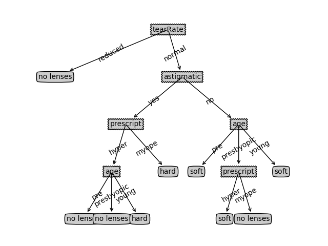

# 《机器学习实战》3.3决策树项目案例02：预测隐形眼镜类型
> 搜索微信公众号:'AI-ming3526'或者'计算机视觉这件小事' 获取更多人工智能、机器学习干货  
> csdn：https://blog.csdn.net/baidu_31657889/  
> github：https://github.com/aimi-cn/AILearners

## 1、项目简介
在上一篇文章中，我们学习了决策树算法的其中一个例子来判断鱼类还是非鱼类，接下来，让我们通过另外一个例子解决通过决策树如何预测出患者需要佩戴的隐形眼镜类型。

本文出现的所有代码，均可在github上下载，不妨来个Star把谢谢~：[Github代码地址](https://github.com/aimi-cn/AILearners/tree/master/src/py2.x/ml/jqxxsz/3.DecisionTree/)

隐形眼镜数据集是非常著名的数据集，它包含了很多患者眼部状况的观察条件以及医生推荐的隐形眼镜类型。隐形眼镜类型包括硬材质(hard)、软材质(soft)以及不适合佩戴隐形眼镜(no lenses)。数据来源于UCI数据库，数据存储在文本文件中，数据集下载地址：[数据集下载](https://github.com/aimi-cn/AILearners/blob/master/data/ml/jqxxsz/sourceData/Ch03/lenses.txt)

数据集信息： 
* 特征有四个：age（年龄）、prescript（症状）、astigmatic（是否散光）、tearRate（眼泪数量） 
* 隐形眼镜类别有三类(最后一列)：硬材质(hard)、软材质(soft)、不适合佩戴隐形眼镜(no lenses) 


## 2、开发流程
[完整代码地址](https://github.com/aimi-cn/AILearners/tree/master/src/py2.x/ml/jqxxsz/3.DecisionTree/DecisionTree_demo02.py)
1. 收集数据: 提供的文本文件。
2. 解析数据: 解析 tab 键分隔的数据行
3.分析数据: 快速检查数据，确保正确地解析数据内容，使用 createPlot() 函数绘制最终的树形图。
4. 训练算法: 使用 createTree() 函数。
5. 测试算法: 编写测试函数验证决策树可以正确分类给定的数据实例。
6. 使用算法: 存储树的数据结构，以便下次使用时无需重新构造树。

## 3、结果展示：
在上篇文章的代码基本上，只需要在主函数改为如下代码即可。
```python
import DecisionTree_demo01
import decisionTreePlot
if __name__ == '__main__':
    fr = open('C:/Users/Administrator/Desktop/blog/github/AILearners/data/sourceData/Ch03/lenses.txt')
    #解析tab键分隔的数据行
    lenses = [inst.strip().split('\t') for inst in fr.readlines()]
    print(lenses)
    lensesLabels = ['age', 'prescript', 'astigmatic', 'tearRate']
    myTree_lenses = DecisionTree_demo01.createTree(lenses, lensesLabels)
    decisionTreePlot.createPlot(myTree_lenses)
```
具体的展示图如下所示：

